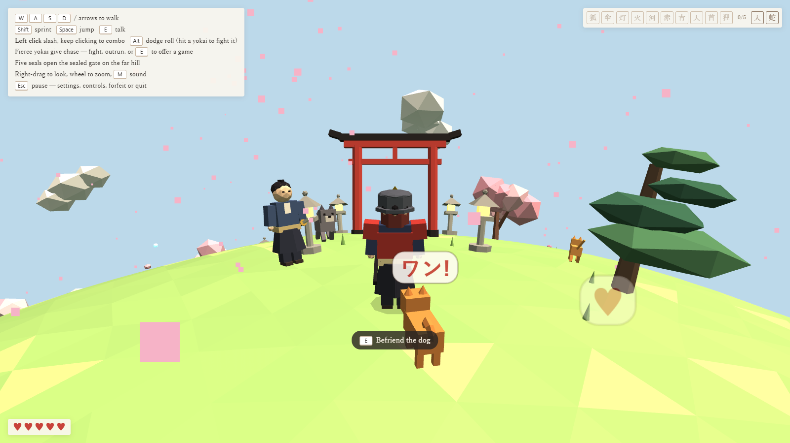
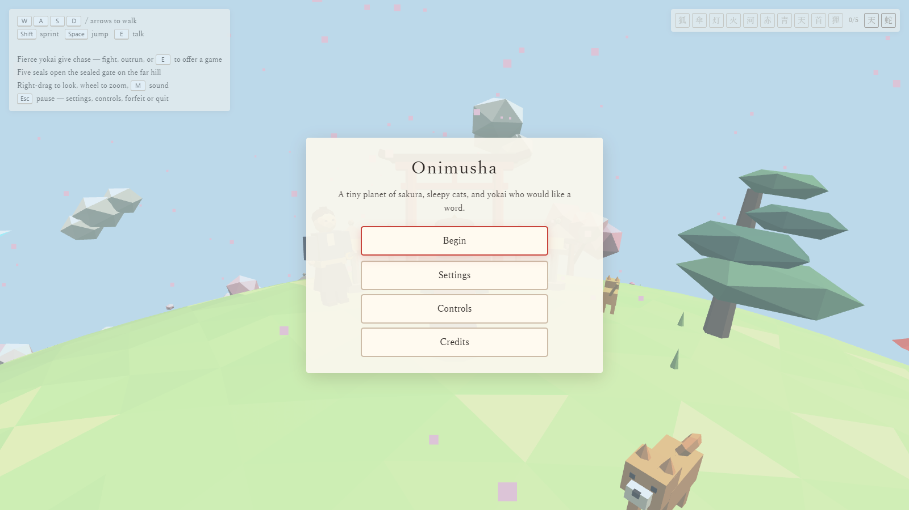
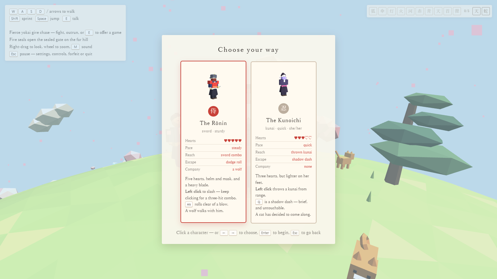
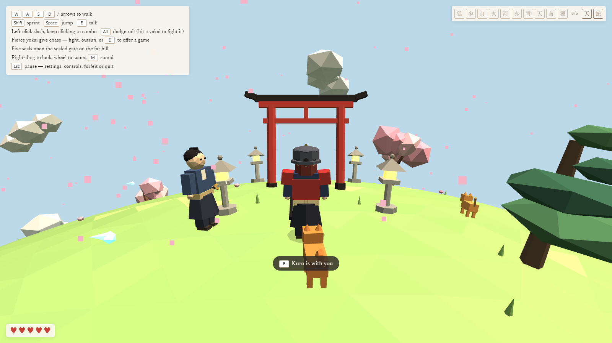
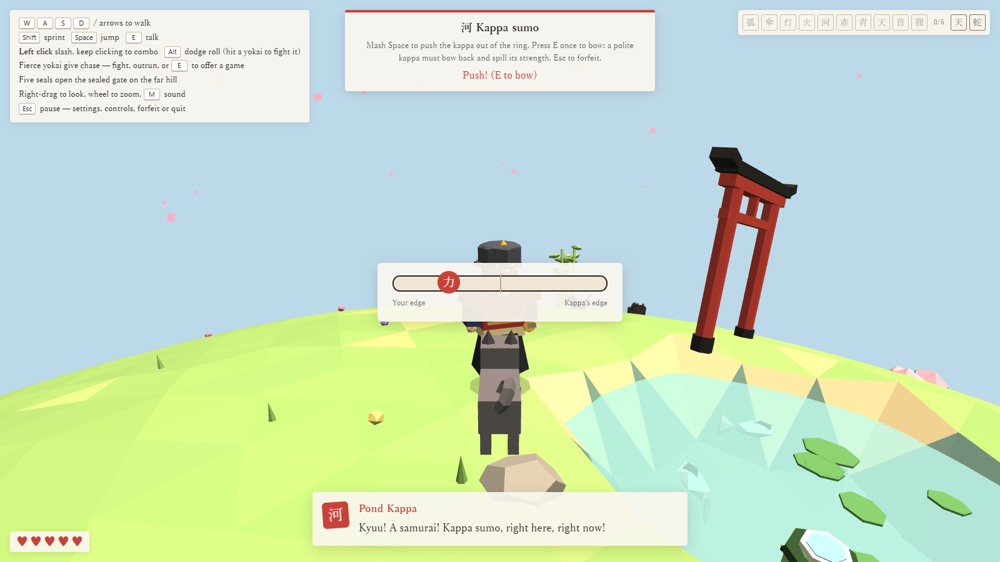
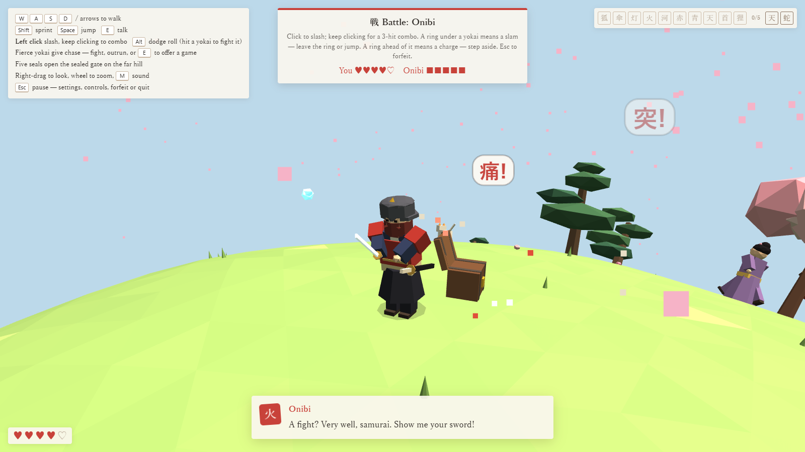
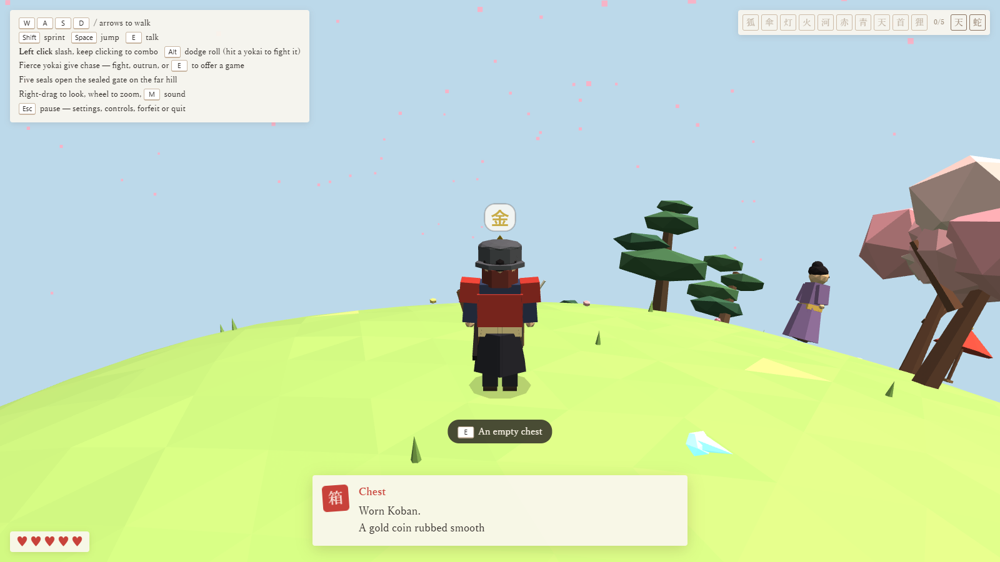
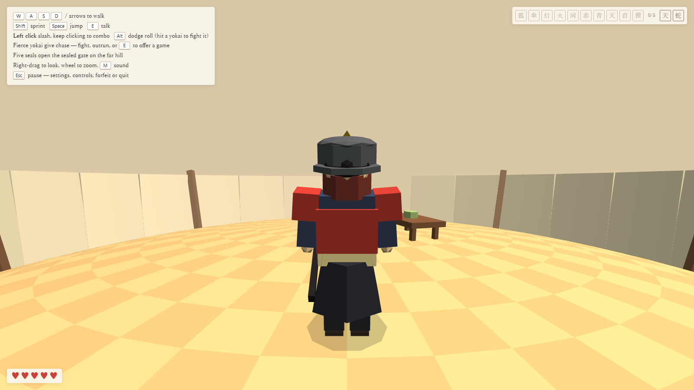
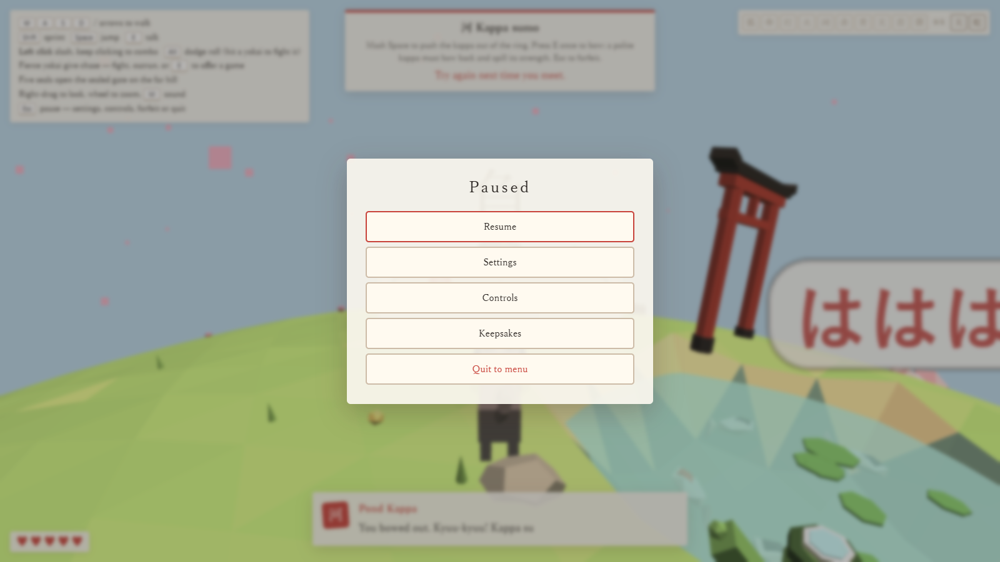

# Onimusha

A tiny planet of samurai, sakura, sleepy cats and yokai, rendered with three.js.

Walk around a small sphere, meet the villagers, and win seals from the yokai — either
by playing their mini-games or by beating them with a blade. Five seals open a sealed
gate on the far hill, and two great yokai are waiting behind it — each fought in a
sealed arena of its own. Fell them both and the journey is told back as an ending
cutscene, brushed in sumi-e ink.

Along the way there are twelve keepsakes left in chests, two buildings you can walk
into, and any cat or dog on the planet will come with you if you ask it nicely.

## Screenshots



Everything above is built from flat-shaded primitives in code — there are no art assets
in this repository.

| | |
|---|---|
|  |  |
| The planet keeps turning behind the title, because it is the running game rather than a picture of one. | Each card shows the figure itself in 3D, and the difference between the two as numbers rather than prose. |
|  |  |
| The villagers walk their own patch of the planet, and what they say follows how far you have got. | Ten mini-games. This one wants six lost wisps gathered inside thirty-five seconds. |
|  |  |
| Or refuse the game and settle it with the blade. Hearts sit bottom-left whether or not you are fighting. | Twelve keepsakes are left in chests. None of them do anything, which is rather the point. |
|  |  |
| The tea house and the pagoda can be walked into, and nothing follows you in. | Settings, controls, keepsakes and a way out, all behind `Esc`. |

## Running it

```bash
npm install     # one dependency, and only for the tests
npm start       # http://localhost:8080
```

The game is plain ES modules with no build step. Browsers refuse to load modules over
`file://`, so it has to be served — `npm start` runs a small static server from the
Node standard library. An import map in `index.html` resolves the bare `three`
specifier to a CDN build; the same specifier resolves from `node_modules` under Node,
so the tests exercise the real modules.

## Tests

```bash
npm test
```

221 behavioural checks across fourteen suites. They boot the real game in a fake browser
(`tests/env.js`) using `vm.SourceTextModule`, which gives every test a fresh module
graph — nothing in `src/` is instrumented or modified to make them work.

`tests/world.test.js` is the unusual one: the whole planet is generated from a single
seeded random stream, so the order the world-building steps run in *is* behaviour. It
compares a fingerprint of the generated world (collider count, every host position to
six decimals, mesh and vertex totals) against a baseline captured before the code was
reorganised.

## Layout

```
index.html              markup and the import map
server.js               static server for development
styles/
  base.css              page shell, title card, character select
  hud.css               everything drawn over the game while you play
  challenges.css        the widgets the mini-games build themselves from
  ending.css            the sumi-e victory cutscene
  pause.css             the pause screen, settings and controls
src/
  main.js               entry point: hands off to Game
  config/               tunable numbers and key bindings, nothing depends on anything
  core/                 renderer, session, boot order, the frame loop, saved preferences
  utils/                maths, randomness, sphere geometry, DOM, scratch vectors
  render/               materials, and the visual effects layer
  world/                terrain, layout, colliders, props, chests, doors, the sealed gate
    arenas/             the sealed places the bosses are fought in, and the two rooms
  physics/              movement on the surface of a sphere
  entities/             the player, the animals, the yokai, the bosses
    models/             the geometry each one is built from
  data/                 who the characters are, what they say, and what is in the chests
  systems/              input, camera, hunting, interaction, spawning, audio
  combat/               battles, boss fights, the katana and the kunai
  challenges/           the challenge flow, the seal book, the ten mini-games
  ui/                   title and character select, dialogue, hud, pause screen
tests/                  the harness and fourteen suites
```

### What each area is responsible for

| Area | Responsibility |
|---|---|
| `config/` | Tunable values only — `settings.js` for gameplay numbers and the player-facing settings, `characters.js` for the two playable characters, `keys.js` for what each action is bound to. No logic, no imports. |
| `core/Stage.js` | The three.js plumbing: renderer, scene, camera, lights, resize. Nothing else touches them. |
| `core/Game.js` | The boot order. The first five calls build the world and **must stay in order** — see below. |
| `core/GameLoop.js` | Timing, hit-stop, and the order systems update in each frame. |
| `core/Session.js` | Whether play has begun, and whether it is paused. Two flags, owned somewhere, so no module reaches for a global. |
| `core/save.js` | Settings, key bindings and run progress in `localStorage`. Treats storage as something that may be missing or refuse to be written, so a save failure never costs you the game. |
| `core/keepsakes.js` | What you are carrying and which chests you have been into. Two sets and the questions worth asking of them, so the chest, the pause screen and the save file need not reach for each other. |
| `entities/pets.js` | The animal walking with you. Befriending is the whole difference between a cat that wanders off and one that follows you around a planet. It never fights — see the note below. |
| `utils/` | Pure helpers. `sphere.js` holds the tangent-space maths everything on the planet needs; `scratch.js` holds reused vectors. |
| `world/` | The planet itself. `terrain.js` answers "how high is the ground here", `colliders.js` answers "can something stand here", `scenery.js` and `props.js` build what you see. |
| `world/Arena.js` | Sealed boss arenas: hides the planet, swaps the ground under the player, and puts everything back. |
| `world/entities.js` | The lists of what is alive. The spawner fills them, the loop walks them, entities join and leave. Deliberately separate from the spawner so consumers don't depend on it. |
| `physics/` | `SurfaceBody` — a position and heading on a sphere, with jump physics. Almost everything that moves owns one. |
| `entities/` | One file per kind of thing, each owning its own behaviour and animation. `models/` holds the geometry builders, kept apart so behaviour files stay readable. |
| `systems/` | Cross-cutting per-frame concerns. `input.js` is the only module that touches the keyboard and mouse; everything else reads its state. |
| `combat/` | `battle.js` is an ordinary fight; `bossBattle.js` extends it. `katana.js` and `kunai.js` are the two characters' weapons. |
| `challenges/` | The flow that runs any challenge, the seal book, and ten independent mini-games. |
| `ui/` | DOM only. No module outside `ui/` writes to the document. `ending.js` paints the sumi-e victory cutscene to a canvas when both bosses fall; `pause.js` holds the pause screen, the settings and the keymap editor. |

## Three things worth knowing before changing code

**The boot order is load-bearing.** `createLayout → createPlanet → buildScenery →
createGate → spawnWorld` all draw from one seeded random stream (`utils/random.js`),
so the planet is identical on every visit. Reordering them, or adding anything that
consumes `rand()` between them, generates a different world. `tests/world.test.js`
will catch it.

**Arenas must not touch the world's random stream.** `world/arenas/*` build from
their own `mulberry32` instance. Calling `rr` or `rand` from `utils/random.js` in
arena code — including indirectly, via a builder in `world/props.js` that uses them —
changes what the rest of the game rolls afterwards. `tests/arena.test.js` checks this.

**Anything placed in the world must earn its draw from the seeded stream.** Chests and
room interiors build from their own `mulberry32`, as the boss arenas already did, and
the chests are placed after everything else. An earlier attempt reserved their ground
before the petals were scattered, which changed how many draws the petals consumed and
quietly altered a yokai's footwork two test suites away.

**Module-level code runs on import.** Anything that needs the world to exist belongs
in an init function called from `Game.js`, not at module scope — at module scope it
runs mid-import, before its dependencies are ready.

## Controls

| | |
|---|---|
| `W A S D` / arrows | walk |
| `Shift` | sprint |
| `Space` | jump |
| Left click | attack — a sword combo, or a thrown kunai |
| `Q` | shadow dash (the kunoichi only) |
| `Alt` | dodge roll (the rōnin only) |
| Right-drag / wheel | look / zoom |
| `M` | mute |
| `E` | talk, accept a challenge, open a chest, step into a building, befriend an animal |
| `Esc` | pause — settings, controls, keepsakes, forfeit or quit |

Every binding above can be changed from the pause screen, and is remembered between
visits.

## Assets

There are none. Every model is built from flat-shaded primitives in code
(`render/materials.js` and the `entities/models/` builders), the textures for speech
bubbles are drawn to a canvas at runtime, and the audio is synthesised from
oscillators in `systems/audio.js`. Dropping in real art means replacing the builders;
the `look` objects in `config/characters.js` are the natural seam to start from.
